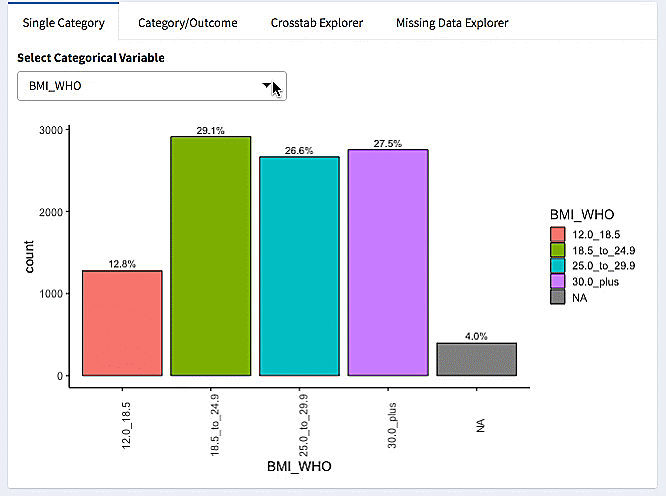
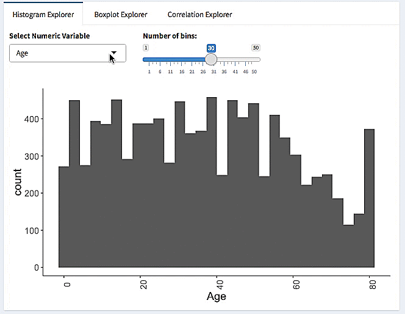
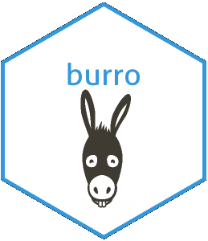

```{r setup, include=FALSE}
knitr::opts_chunk$set(echo = FALSE)
```

## Overview

- Data Scavenger Hunts
- Example: NHANES
- The `burro` R package: make a dataset explorable

## Motivation

- Students really don't look at data
- Don't see Exploratory Data Analysis as valuable

## What are Data Scavenger Hunts?

- Centered around a dataset
- Group/Collaborative Activity
- Web app for exploring data
- Questions to explore and report back

## Example: NHANES

- National Health and Nutrition Examination Survey
- Lots of outcomes, and is of broad interest
- Looked at Depression, Type 2 Diabetes, Physical Activity as outcomes

## Example Questions

- Is there an association of `LittleInterest` with `Depressed`?
- Is marijuana use associated with depression?
- What is the oldest person in the dataset? Any idea why?

## Burro(w) into the data 

Is `LittleInterest` associated with `Depressed`?



## Burro: Boxplots

Are Sleep Hours associated with Depression?


## Burro package

- R package that builds shareable Shiny apps for data exploration
- Authors: Jessica Minnier and Ted Laderas
- http://laderast.github.io/burro/



## Outcomes

- "The scavenger hunt. It is great place to apply this knowledge."
- "I enjoyed the collaborative and self-paced approach."
- "I liked the dataset and the open curiosity element of the workshop."
  
Noticable improvement in confidence to do Data Exploration!

## For more info

- Slides are here: http://bit.ly/lst_talk
- laderast@ohsu.edu
- @tladeras
- http://laderast.github.io/
- http://laderast.github.io/burro/
- Try it out! http://tladeras.shinyapps.io/nhanes_explore/
